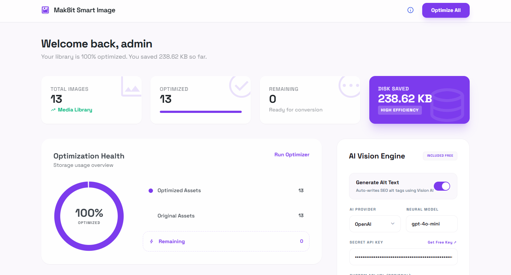
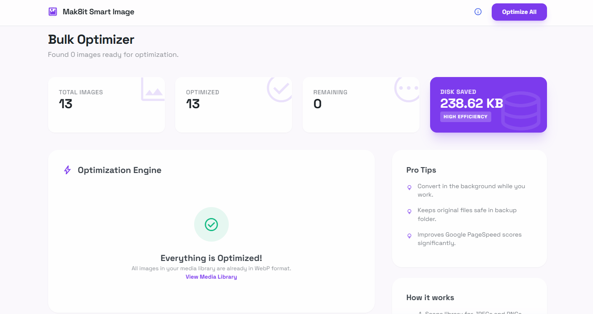

# M8 Smart Image (Mak8it Smart Image)

**M8 Smart Image** is a high-performance WordPress plugin designed to automatically optimize website assets. It converts media library images to the modern WebP format on your server (saving 40–80% in file size) and uses advanced Vision AI (Google Gemini or OpenAI) to generate descriptive, SEO-optimized alt text in one click.

---

## 📸 Screenshots

| 📊 Dashboard & Stats | 🚀 Bulk Converter |
|---|---|
|  |  |

---

## 🚀 Key Features

* **Local WebP Conversion** — Converts JPEG, PNG, and JFIF uploads directly on your server using PHP's GD Library or Imagick. No data leaves your host for image compression.
* **AI-Powered Alt Text** — Automatically writes descriptive, SEO-friendly alt tags using Google Gemini or OpenAI vision models (requires your own API key).
* **One-Click Bulk Optimizer** — Scans and converts your entire existing media library in the background with real-time progress and disk space savings tracking.
* **Original Backup Strategy** — Safely keeps original files alongside the new WebP versions, allowing seamless restoration.
* **Modern SaaS-Style Admin Dashboard** — A beautiful, interactive dashboard containing storage stats, recent conversion tables, and optimization health charts.
* **Custom API Proxy Support** — Direct option to customize API endpoints and URLs for full privacy control.

---

## 🛠️ Server Requirements

To run WebP conversion locally, your server needs one of the following PHP libraries:
* **GD Library** (with WebP support enabled, standard on most hosting plans)
* **Imagick** (compiled with WEBP format support)

*The plugin includes a **System Status** page to automatically verify your server configuration.*

---

## 📦 Installation & Setup

### 1. Manual Upload
1. Download this repository as a `.zip` file.
2. Go to your WordPress Dashboard -> **Plugins** -> **Add New** -> **Upload Plugin**.
3. Upload the ZIP, click **Install Now**, and then **Activate**.

### 2. FTP Upload
1. Clone or extract this repository into your `/wp-content/plugins/` directory.
2. Activate the plugin via the **Plugins** page in WordPress.

---

## 💡 AI Vision Engine Setup

To enable automated Alt Text generation for your uploads:
1. Navigate to **M8 Smart Image** -> **Dashboard**.
2. Locate the **AI Vision Engine** settings card on the right.
3. Choose your provider:
   * **Google Gemini** (Default: `gemini-1.5-flash`)
   * **OpenAI** (Default: `gpt-4o-mini`)
   * **Custom** (OpenAI compatible proxy endpoints)
4. Paste your secret API key.
5. Click **Save AI Engine** and run a connection test using the **Test API** button to verify.

---

## 🔒 Privacy & Data Flow

* **Image Compression**: Stays 100% local. No images are sent to any external compression APIs.
* **AI Alt Text**: If enabled, the plugin sends a resized, low-resolution thumbnail (max 512×512px) directly to Google or OpenAI to parse and generate alt text. No personal user data or site information is transmitted.

---

## 📄 License

This project is licensed under the GPL-v2 (or later) license. See the [GNU General Public License](https://www.gnu.org/licenses/gpl-2.0.html) for more details.
